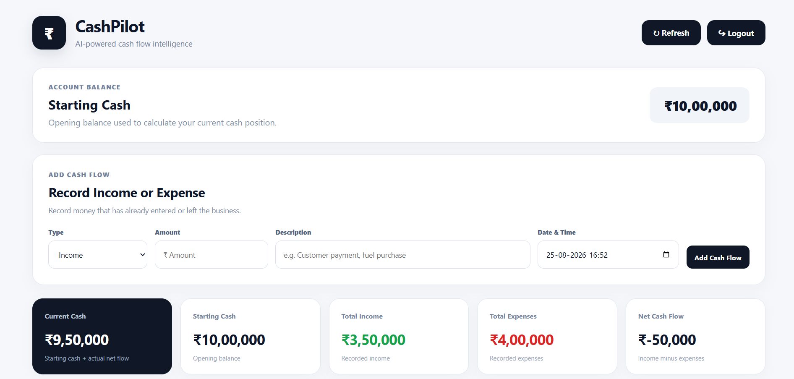
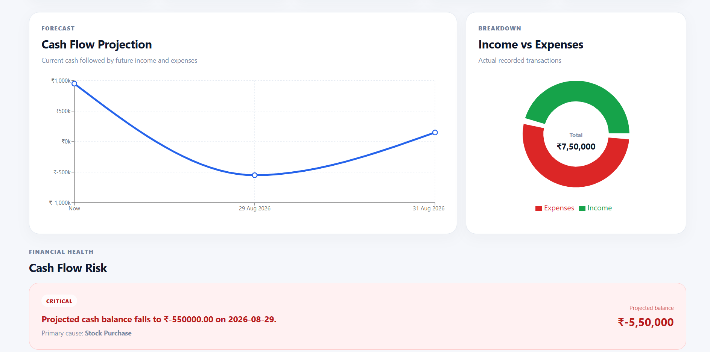
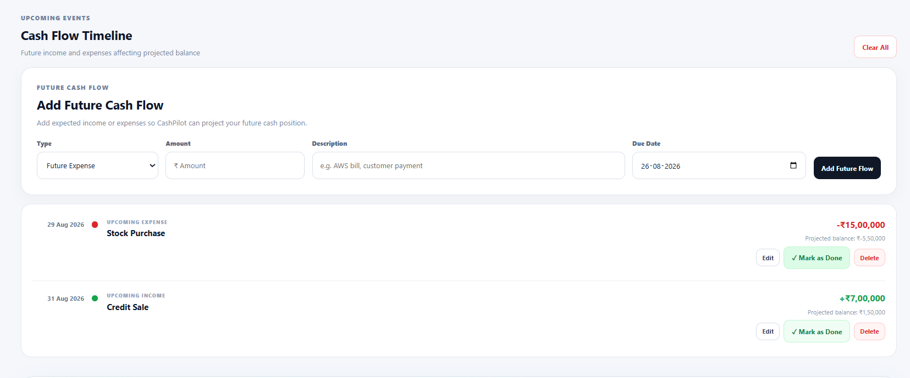
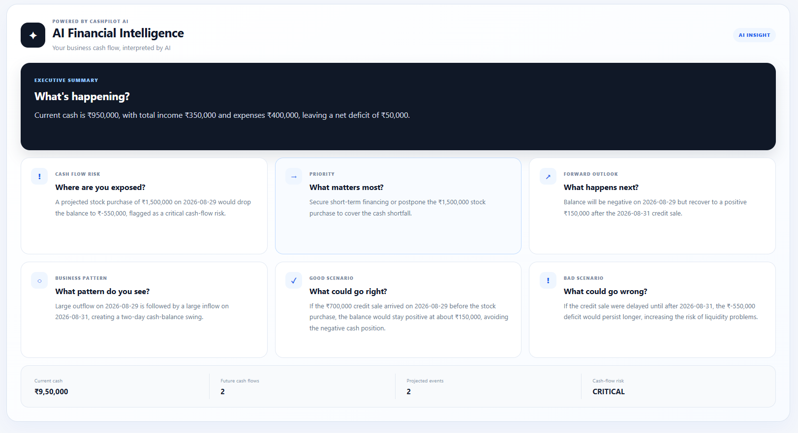

# CashPilot

AI-powered cash-flow management and financial decision-support platform for businesses.

CashPilot helps businesses understand their current cash position, forecast future cash flow, identify liquidity risks, receive practical recommendations, and explore hypothetical good and bad cash-flow scenarios.

## Live Demo

🌐 **[Visit CashPilot](https://cashpilot.co.in)**

---

## Features

### Cash Flow Management

- Track income and expenses
- View current cash position
- View cash-flow summaries
- Add upcoming income and expenses
- Manage future cash obligations
- Mark future obligations as completed

### Cash Flow Projection

CashPilot projects future cash balances using upcoming cash inflows and outflows.

Each projection contains:

- Date
- Cash-flow change
- Running cash balance
- Description

### Risk Detection

The system identifies the lowest projected cash balance and classifies the risk as:

```text
LOW
WARNING
CRITICAL
```

### Financial Recommendations

CashPilot provides recommendations based on upcoming financial obligations and projected cash flow, including:

- Large upcoming expenses
- Incoming payments before expenses
- Cash-buffer requirements
- Infrastructure spending
- Cash-flow risks

### AI Financial Analysis

CashPilot provides:

- Financial summary
- Risk explanation
- Business pattern
- Priority action
- Near-term outlook
- Good scenario
- Bad scenario

The AI uses the supplied financial data and is instructed not to invent transactions, amounts, dates, payments, customers, income, expenses, or events.

---

## AI Cash-Flow Scenarios

The Good Scenario and Bad Scenario are **hypothetical timing what-if analyses**.

### Good Scenario

The AI considers favorable timing changes involving existing future cash flows, such as:

- A payment arriving early
- A payment arriving before an important expense
- An expense being delayed

It explains how the timing change could improve the cash position or prevent/reduce a projected negative balance.

### Bad Scenario

The AI considers unfavorable timing changes, such as:

- A payment being delayed
- A payment arriving after an important expense
- An expense arriving earlier
- An expense occurring before expected income

It explains how the timing change could increase cash pressure or cause the balance to become negative.

The scenarios are hypothetical and are not presented as events that will actually happen.

---

## Screenshots

### Dashboard



### Cash Flow Projection



### Future Transactions



---

### AI Financial Analysis




## Architecture

```text
                         CashPilot

        ┌───────────────────────────────┐
        │        React Frontend         │
        └───────────────┬───────────────┘
                        │ REST API
                        ▼
        ┌───────────────────────────────┐
        │      Spring Boot Backend      │
        │                               │
        │ Auth • Transactions           │
        │ Cash Flow • Risk              │
        │ Obligations • Recommendations │
        └───────────┬───────────┬───────┘
                    │           │
                    │           ▼
                    │      PostgreSQL
                    │
                    ▼
        ┌───────────────────────────────┐
        │     Python FastAPI AI Service │
        └───────────────┬───────────────┘
                        │
                        ▼
                   ┌─────────┐
                   │ Groq API│
                   └─────────┘
```

### Components

**React Frontend**

Provides the user interface and communicates with the backend through REST APIs.

**Spring Boot Backend**

Handles authentication, transactions, cash-flow calculations, projections, risk detection, recommendations, and communication with the AI service.

**PostgreSQL**

Stores application and financial data.

**Python AI Service**

Processes structured financial data and generates the AI-powered financial analysis.

**Groq API**

Provides the language-model generation used by the AI service.

---

## Cash-Flow Logic

For income:

```text
New Balance = Previous Balance + Income
```

For expense:

```text
New Balance = Previous Balance - Expense
```

Future obligations are processed chronologically to calculate the projected running balance.

Risk is determined from the lowest projected balance:

```text
Balance <= ₹10,000
        → CRITICAL

₹10,000 < Balance <= ₹25,000
        → WARNING

Balance > ₹25,000
        → LOW
```

---

## API

Backend API base path:

```text
/api
```

### Authentication

```text
POST /api/auth/login
POST /api/auth/register
```

### Cash Flow

```text
GET /api/cashflow/summary
GET /api/cashflow/projection
GET /api/cashflow/risk
GET /api/cashflow/recommendations
```

### Cash Obligations

```text
POST   /api/obligations
GET    /api/obligations
GET    /api/obligations/upcoming
PUT    /api/obligations/{id}
POST   /api/obligations/{id}/complete
DELETE /api/obligations/{id}
GET    /api/obligations/projection
GET    /api/obligations/risk
GET    /api/obligations/recommendations
```

### AI Analysis

```text
POST /api/ai/analyze
```

The AI response contains:

```text
summary
riskExplanation
businessPattern
priorityAction
outlook
goodScenario
badScenario
```

---

## Project Structure

```text
cashpilot-ai/
│
├── frontend/          # React frontend
├── backend/           # Spring Boot backend
├── ai-service/        # Python FastAPI AI service
├── docs/              # Additional documentation
├── screenshots/       # Project screenshots
└── README.md
```

---

## Technology Stack

| Layer | Technology |
|---|---|
| Frontend | React |
| Build Tool | Vite |
| Backend | Spring Boot |
| Backend Language | Java |
| Database | PostgreSQL |
| AI Service | Python |
| AI Framework | FastAPI |
| AI Provider | Groq |
| AI Model | `openai/gpt-oss-120b` |

---

## Local Development

CashPilot is deployed and available at **[cashpilot.co.in](https://cashpilot.co.in)**.

For developers who want to run the project locally, the services can be started separately.

### Frontend

```bash
cd frontend
npm install
npm run dev
```

### Backend

```bash
cd backend
mvn spring-boot:run
```

### AI Service

```bash
cd ai-service
python -m uvicorn app.main:app --reload
```

The AI service requires:

```text
GROQ_API_KEY
```

Production configuration and secrets are provided through environment variables.

---

## Deployment

CashPilot is deployed as separate services:

```text
React Frontend
       │
       ▼
Spring Boot Backend
       │
       ├── PostgreSQL
       │
       ▼
Python AI Service
       │
       ▼
Groq API
```

The public application is available at:

**https://cashpilot.co.in**

---

## Security

Financial operations are performed in the context of the authenticated user.

User-specific data is used for:

- Transactions
- Cash obligations
- Cash-flow projections
- Risk analysis
- Financial recommendations

Secrets such as API keys and database credentials are stored through environment configuration and are not committed to the repository.

---

## Development Workflow

```text
Develop
   ↓
Test locally
   ↓
Review changes
   ↓
Commit
   ↓
Push to Git
   ↓
Deploy
   ↓
Verify production
```

---

## Project Goal

CashPilot goes beyond simply displaying financial data.

It combines deterministic cash-flow calculations with AI-powered interpretation to help businesses answer:

```text
How much cash do I have?
        ↓
What will happen to my cash?
        ↓
Where is the risk?
        ↓
What should I do?
        ↓
What if cash arrives earlier?
        ↓
What if cash arrives later?
```

The goal is to turn cash-flow data into practical financial decision support.